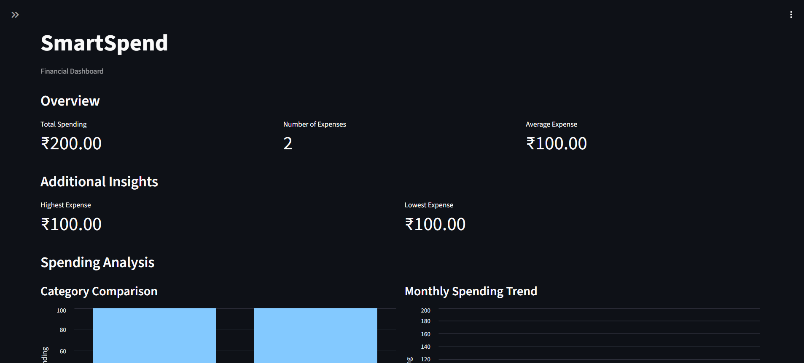
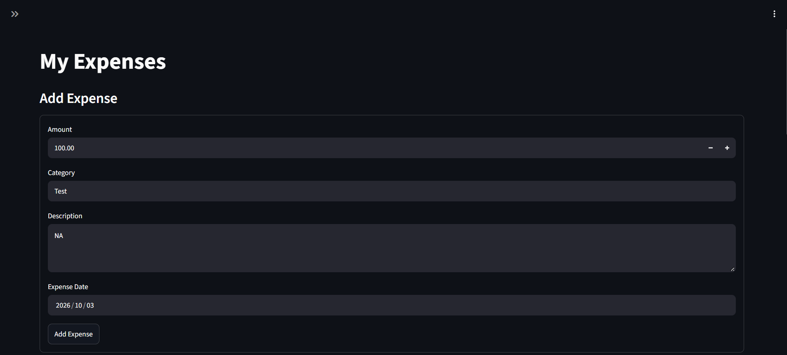
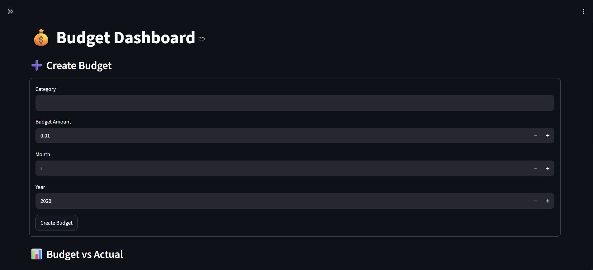
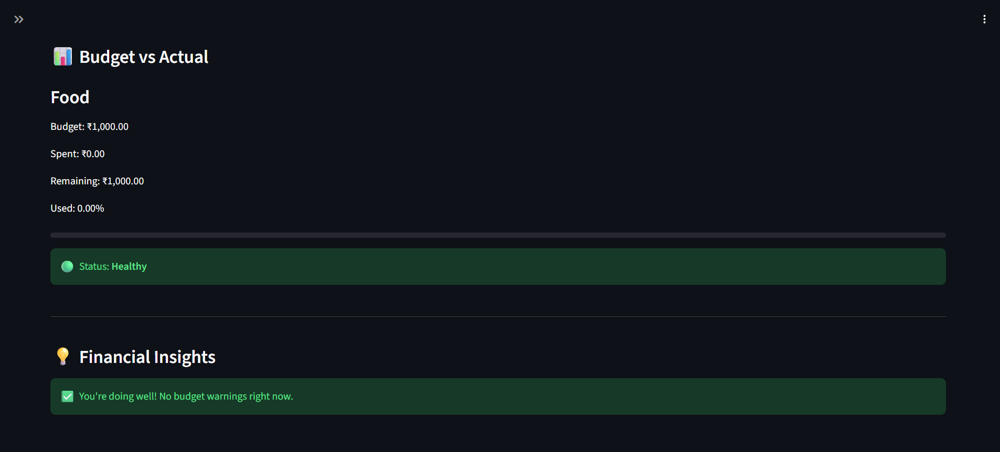
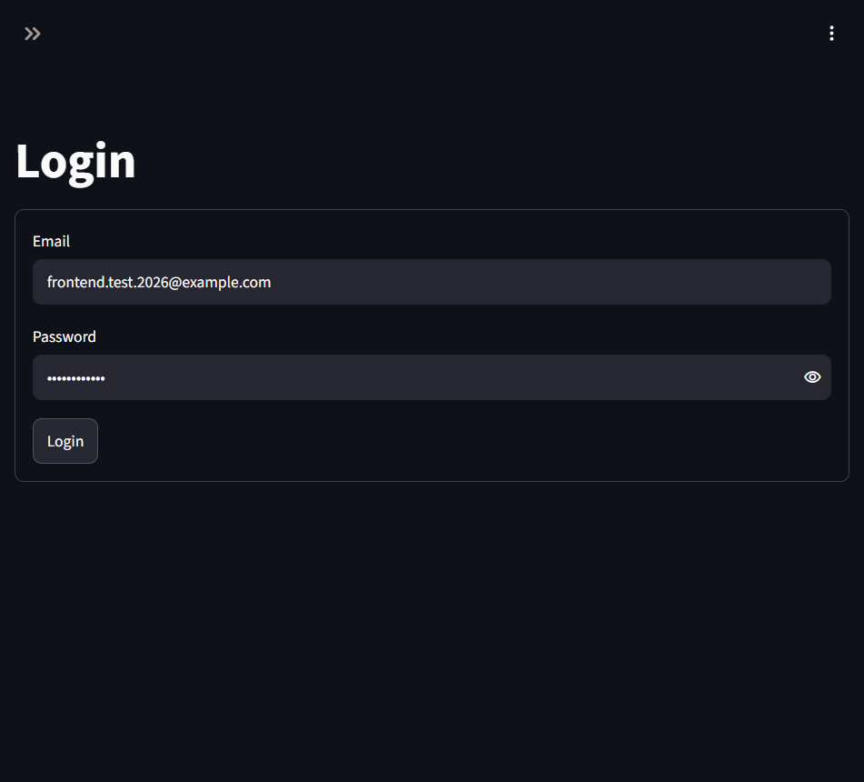
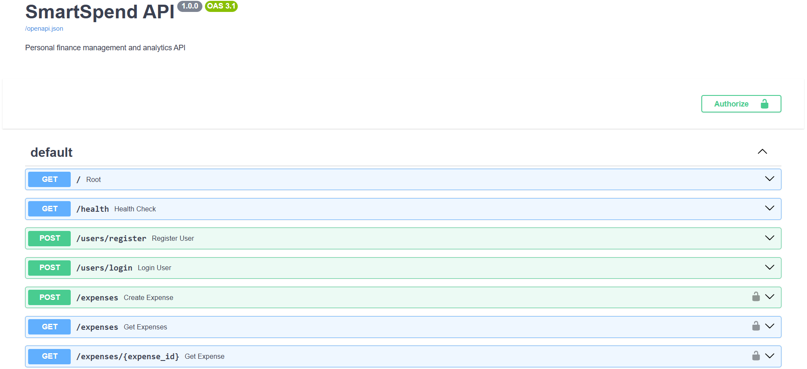

# 💰 SmartSpend

**SmartSpend** is a full-stack personal finance management application for tracking expenses, managing category-based monthly budgets, analyzing spending patterns, and generating budget-related financial insights.

It uses a separated **Streamlit frontend → FastAPI backend → PostgreSQL database** architecture with JWT authentication, password hashing, user-level authorization, automated tests, environment-based configuration, and production deployment.

## 🌐 Live Demo

- **Live Application:** https://smartspend-frontend-m5rc.onrender.com
- **Backend API:** https://smartspend-htos.onrender.com
- **Interactive API Docs:** https://smartspend-htos.onrender.com/docs
- **GitHub:** https://github.com/AquasaAziz247/SmartSpend

> The deployed application may take a short time to wake after inactivity when using a free hosting instance.

---

## 🎯 Problem Statement

Personal expenses can become difficult to track when spending records, monthly budgets, and spending trends are kept separately.

SmartSpend provides a single application where users can:

- Record and manage expenses
- Organize spending by category
- Set monthly category-based budgets
- Compare budgets with actual spending
- Analyze spending patterns
- Receive budget-related financial insights

---

## 🚀 Features

### 👤 Authentication & Authorization

- User registration and login
- Password hashing with bcrypt
- JWT-based authentication
- Protected API endpoints
- User-specific resource access
- Ownership checks for expenses and budgets

### 💸 Expense Management

- Create, view, update, and delete expenses
- Filter by category
- Filter by amount range
- Filter by date range
- Sort expenses
- Pagination

### 📊 Financial Analytics

- Total spending
- Expense count
- Average expense
- Highest and lowest expense
- Category-wise spending
- Monthly spending
- Monthly spending trends
- Month-over-month percentage changes

### 💰 Budget Management

- Create, view, update, and delete category-based monthly budgets
- Prevent duplicate budgets for the same category and month
- Compare budgeted amount with actual spending
- Calculate budget utilization
- Calculate remaining budget
- Track budget status

### 💡 Financial Insights

Budget-related insights based on spending and budget utilization, including:

- Approaching budget limit
- Budget warnings
- Near-limit conditions
- Over-budget alerts

---

## 🛠️ Technology Stack

| Layer | Technology |
|---|---|
| Language | Python |
| Frontend | Streamlit |
| Backend | FastAPI |
| Database | PostgreSQL |
| Authentication | JWT |
| Password Hashing | bcrypt |
| Validation | Pydantic |
| API Communication | REST / HTTP |
| Database Driver | psycopg2 |
| Testing | pytest |
| API Testing | HTTPX |
| Configuration | python-dotenv |
| Application Server | Uvicorn |
| Production Backend | Render |
| Production Database | Supabase PostgreSQL |
| Production Frontend | Render |

---

## 🏗️ Architecture

```text
                         🌐 User
                           │
                           ▼
                 ┌────────────────────┐
                 │     Streamlit      │
                 │      Frontend      │
                 └─────────┬──────────┘
                           │ HTTP
                           │ JWT
                           ▼
                 ┌────────────────────┐
                 │      FastAPI       │
                 │      Backend       │
                 ├────────────────────┤
                 │ Authentication     │
                 │ Authorization      │
                 │ Expenses           │
                 │ Analytics          │
                 │ Budgets            │
                 │ Financial Insights │
                 └─────────┬──────────┘
                           │
                           ▼
                 ┌────────────────────┐
                 │     PostgreSQL     │
                 │      Database      │
                 └────────────────────┘
```

### Request flow

```text
User
  ↓
Streamlit UI
  ↓
HTTP request
  ↓
FastAPI
  ↓
JWT authentication
  ↓
Authorization / ownership checks
  ↓
Database operations
  ↓
JSON response
  ↓
Streamlit UI
```

---

## 🗄️ Database Design

The application uses PostgreSQL with the main application tables:

```text
users
 ├── id
 ├── name
 ├── email
 └── password_hash

expenses
 ├── id
 ├── user_id
 ├── amount
 ├── category
 ├── description
 └── expense_date

budgets
 ├── id
 ├── user_id
 ├── category
 ├── amount
 ├── month
 └── year
```

Expenses and budgets are associated with users so that authenticated users access only their own financial resources.

The database schema is stored in:

```text
database/schema.sql
```

---

## 📡 API Documentation

SmartSpend exposes a REST API through FastAPI.

### Authentication

| Method | Endpoint | Auth |
|---|---|---|
| POST | `/users/register` | Public |
| POST | `/users/login` | Public |

### Expenses

| Method | Endpoint | Auth |
|---|---|---|
| POST | `/expenses` | JWT |
| GET | `/expenses` | JWT |
| GET | `/expenses/{expense_id}` | JWT |
| PUT | `/expenses/{expense_id}` | JWT |
| DELETE | `/expenses/{expense_id}` | JWT |

### Analytics

| Method | Endpoint | Auth |
|---|---|---|
| GET | `/analytics/summary` | JWT |
| GET | `/analytics/categories` | JWT |
| GET | `/analytics/monthly` | JWT |
| GET | `/analytics/trends` | JWT |

### Budgets

| Method | Endpoint | Auth |
|---|---|---|
| POST | `/budgets` | JWT |
| GET | `/budgets` | JWT |
| PUT | `/budgets/{budget_id}` | JWT |
| DELETE | `/budgets/{budget_id}` | JWT |
| GET | `/budgets/comparison` | JWT |

### Insights

| Method | Endpoint | Auth |
|---|---|---|
| GET | `/insights` | JWT |

### Interactive documentation

FastAPI provides Swagger UI:

**Production:** https://smartspend-htos.onrender.com/docs

**Local:** `http://127.0.0.1:8000/docs`

---

## 🔐 Security

SmartSpend uses several application-level security controls:

- Passwords are hashed using bcrypt rather than stored as plaintext.
- JWT access tokens protect authenticated API endpoints.
- Protected endpoints require authentication.
- User IDs are derived from authenticated JWTs rather than trusted client input.
- User-specific resources use ownership checks.
- Database operations use parameterized queries.
- Production secrets are supplied through environment variables.
- `.env` and `.env.production` are excluded from Git.
- Invalid authentication returns `401 Unauthorized`.
- Invalid request data is validated and can return `422 Unprocessable Entity`.
- Requests for non-existent resources can return `404 Not Found`.

No production database password or JWT secret is stored in the repository.

---

## 📁 Project Structure

```text
SmartSpend/
│
├── backend/
│   ├── main.py
│   ├── security.py
│   ├── db.py
│   ├── schemas.py
│   └── insights.py
│
├── frontend/
│   ├── app.py
│   ├── api.py
│   └── pages/
│       ├── about.py
│       ├── analytics.py
│       ├── budget.py
│       ├── expenses.py
│       ├── login.py
│       └── register.py
│
├── database/
│   └── schema.sql
│
├── tests/
│   ├── conftest.py
│   ├── test_api.py
│   ├── test_auth.py
│   ├── test_authorization.py
│   ├── test_budgets.py
│   ├── test_expenses.py
│   ├── test_insights.py
│   ├── test_integration.py
│   └── test_validation.py
│
├── .env.example
├── .gitignore
├── README.md
└── requirements.txt
```

---

## ⚙️ Local Setup

### 1. Clone the repository

```bash
git clone https://github.com/AquasaAziz247/SmartSpend.git
cd SmartSpend
```

### 2. Create a virtual environment

Windows PowerShell:

```powershell
python -m venv venv
.\venv\Scripts\Activate.ps1
```

### 3. Install dependencies

```powershell
pip install -r requirements.txt
```

### 4. Configure environment variables

Create a local `.env` file based on `.env.example`.

Required backend variables:

```env
DB_HOST=your_database_host
DB_PORT=5432
DB_NAME=your_database_name
DB_USER=your_database_user
DB_PASSWORD=your_database_password
JWT_SECRET_KEY=your_jwt_secret
```

Frontend configuration:

```env
API_BASE_URL=http://127.0.0.1:8000
```

Never commit `.env` or production secrets.

### 5. Start the FastAPI backend

```powershell
uvicorn backend.main:app --reload
```

Backend:

```text
http://127.0.0.1:8000
```

Swagger:

```text
http://127.0.0.1:8000/docs
```

### 6. Start the Streamlit frontend

Open another terminal:

```powershell
streamlit run frontend/app.py
```

---

## 🧪 Testing

SmartSpend includes automated tests covering authentication, authorization, expenses, budgets, analytics, insights, validation, and integration behavior.

Run:

```powershell
python -m pytest
```

The production-readiness regression run completed with:

```text
79 passed
```

Additional production checks verified:

- Registration
- Login
- JWT authentication
- Protected endpoint access
- Logout behavior
- Invalid credentials
- Invalid expense input
- Non-existent resources
- Budget handling
- Frontend error handling
- Live database connectivity

---

## 🌐 Deployment

SmartSpend is deployed using:

```text
GitHub
   │
   ├── Render → Streamlit frontend
   │
   └── Render → FastAPI backend
                    │
                    ▼
             Supabase PostgreSQL
```

### Production services

**Frontend**

https://smartspend-frontend-m5rc.onrender.com

**Backend**

https://smartspend-htos.onrender.com

**API documentation**

https://smartspend-htos.onrender.com/docs

Production configuration is provided through hosting-platform environment variables rather than committed secrets.

---

## 📸 Screenshots

### 📊 Analytics Dashboard



### 💸 Expense Management



### 💰 Budget Management



### 💡 Financial Insights



### 🔐 Authentication



### 📡 REST API



---

## 🧠 Engineering Decisions

### Separate frontend and backend

Streamlit handles the user interface while FastAPI owns API behavior and business operations. This keeps presentation and backend responsibilities separated.

### JWT authentication

JWT allows the backend to authenticate API requests without relying on client-provided user IDs for protected resources.

### PostgreSQL

A relational database fits SmartSpend's structured relationships between users, expenses, and budgets.

### Environment-based configuration

Database credentials, JWT secrets, and API URLs are supplied through environment variables so deployment configuration can change without modifying application logic.

### Automated testing

The project uses pytest and HTTPX to validate application behavior and reduce regressions during development and deployment.

---

## 🧩 Challenges & Solutions

### Local-to-production configuration

**Challenge:** The application needed different database and API configuration in local and production environments.

**Solution:** Environment variables were used to separate configuration from application logic.

### Production database connectivity

**Challenge:** The deployed backend needed reliable connectivity to hosted PostgreSQL.

**Solution:** The production backend was connected to Supabase PostgreSQL using the appropriate pooled connection configuration.

### Frontend/backend communication

**Challenge:** The Streamlit frontend had to communicate with the deployed FastAPI backend instead of a local `localhost` API.

**Solution:** The frontend uses `API_BASE_URL`, which points to the deployed FastAPI service in production.

### Production regression testing

**Challenge:** Local tests alone do not verify the deployed environment.

**Solution:** The deployed application was tested end-to-end, including authentication, protected endpoints, expense operations, analytics, budgets, insights, validation, and error handling.

---

## 🔮 Future Improvements

Potential future improvements include:

- Automated CI/CD pipeline
- Role-based access control
- More advanced spending forecasts
- Recurring expense support
- Exportable financial reports
- Improved dashboard visualizations
- Custom date-range analytics
- More granular notification preferences
- Production monitoring and observability
- Custom domain deployment

---

## 🎯 Project Goals

SmartSpend was built to practice and demonstrate:

- REST API development
- Backend architecture
- Authentication and authorization
- PostgreSQL database design
- Data validation
- Financial analytics
- Streamlit application development
- Automated testing
- Production deployment
- Git/GitHub workflow
- Secure environment configuration

---

## 👤 Author

**Aquasa Aziz**

B.Tech Computer Science and Business Systems

- GitHub: https://github.com/AquasaAziz247

---

## 📄 License

This project is available for educational and portfolio purposes.
